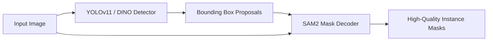

# Hospital Object Segmentation: Research & Analysis

## 1. Project Overview

This project aims to perform **instance segmentation on 26 hospital object classes** (C-Arm, Patient bed, Monitor, Saline stand, etc.) using a COCO-format dataset from Roboflow with **~17,250 training images** and **~1,000 validation images**. Three approaches have been explored:

| Approach | Architecture | mAP50 | Status |
|----------|-------------|-------|--------|
| **YOLOv11** (Roboflow) | YOLO anchor-free detector | **79%** | Baseline ✅ |
| **Mask2Former** | Swin-Large + transformer decoder | < 79% | Trained 40 epochs |
| **SAM2-UNet** | Hiera-Large frozen backbone + adapter + UNet decoder | ~15% | 1 epoch (early) |

---

## 2. Analysis of Each Approach

### 2.1 YOLOv11 — The Baseline (79% mAP50)

YOLOv11 is a hybrid architecture combining efficient depth-wise convolutions, anchor-free detection, and advanced feature pyramids. It excels on this dataset because:

- **End-to-end instance detection**: directly predicts bounding boxes + masks per instance with no post-processing conversion needed
- **Optimised for medium-scale datasets**: YOLO architectures are designed for fast convergence with strong augmentation pipelines, which Roboflow provides out-of-the-box
- **Low VRAM footprint** (~1.3GB): allows larger batch sizes and more stable gradient estimates
- **Fast inference** (~560ms): enables rapid iteration during development

> [!NOTE]
> The 79% mAP50 from Roboflow likely benefits from their AutoAugment pipeline, optimised training schedules, and possibly hyperparameter sweeps that are hard to replicate manually.

### 2.2 Mask2Former — Close but Not Surpassing

Mask2Former uses a Swin-Large backbone with a transformer-based pixel decoder and masked attention queries for instance segmentation.

**Why it underperforms YOLOv11 on this dataset:**

| Factor | Impact |
|--------|--------|
| **High VRAM cost** (~11.7GB) | Forces small batch sizes (2), leading to noisy gradients |
| **Training dynamics** | Transformer decoders are sensitive to LR, warmup, and query count — requires extensive hyperparameter tuning |
| **Domain gap** | COCO pretrained weights don't perfectly transfer to hospital environments (different lighting, clutter, object types) |
| **40 epochs may be insufficient** | Mask2Former typically needs 50–100+ epochs with careful scheduling to fully converge on new domains |
| **Small/medium object detection** | Hospital scenes contain many small objects (Door Handlers, Foot stools) where YOLO's feature pyramid excels |

**The positive**: Mask2Former does perform *respectably* — its architecture fundamentally supports high-quality masks and handles overlapping instances well through learned queries. With longer training and tuning, it could close the gap.

### 2.3 SAM2-UNet — 15% mAP50 (1 Epoch)

The SAM2-UNet approach uses SAM2's Hiera-Large as a frozen backbone with lightweight 1×1 conv adapters and a UNet decoder for semantic segmentation, then uses connected-component post-processing to extract instances.

**Fundamental limitations:**

1. **Semantic → Instance Gap**: This is the biggest bottleneck. Semantic segmentation predicts per-pixel classes without instance awareness:
   - **Touching/overlapping objects merge**: Two adjacent Patient beds become one instance
   - **Fragmented predictions split**: One large object with internal discontinuities becomes multiple false instances
   - **No confidence scoring**: Connected-component "confidence" (mean class probability) is a poor proxy for detection confidence

2. **Frozen backbone with minimal adaptation**: Only ~98K adapter parameters adapt the 213M-parameter backbone — this may be insufficient for domain transfer from SAM2's generic pretraining to hospital-specific features

3. **1 epoch is too early to judge**: With 17k images at batch_size=2, one epoch = 8,625 steps. The model has barely begun learning. The 15% mAP50 reflects early training, not architecture limits

4. **Resolution mismatch**: 1024×1024 input is memory-intensive; the three FPN stages (256×256, 128×128, 64×64) may lose fine details of small hospital objects

**SAM2-UNet sample predictions after 1 epoch:**

````carousel

<!-- slide -->

<!-- slide -->

````

---

## 3. Pros & Cons Summary

### Augmentation / Segmentation Approach Comparison

| Dimension | YOLOv11 | Mask2Former | SAM2-UNet |
|-----------|---------|-------------|-----------|
| **Instance awareness** | ✅ Native | ✅ Native (queries) | ❌ Semantic + post-proc |
| **Small object detection** | ✅ Strong FPN | ⚠️ Moderate | ❌ Weak (large strides) |
| **Overlapping objects** | ⚠️ Box-based | ✅ Excellent | ❌ Merges instances |
| **Mask quality** | ⚠️ Coarse | ✅ Fine-grained | ⚠️ Depends on decoder |
| **Training efficiency** | ✅ Fast convergence | ❌ Slow, requires tuning | ⚠️ Few trainable params |
| **VRAM usage** | ✅ ~1.3GB | ❌ ~11.7GB | ⚠️ ~8-10GB |
| **Ease of use** | ✅ Roboflow turnkey | ❌ Complex setup | ❌ Custom pipeline |
| **Scalability** | ✅ Real-time inference | ❌ Slow inference | ⚠️ Moderate |

---

## 4. Future Suggestions

### 4.1 Priority: Improve Mask2Former (Most Likely to Beat 79%)

The fastest path to surpassing YOLOv11 is to tune the existing Mask2Former pipeline:

1. **Train longer**: Extend to 80–100 epochs with patience-based early stopping
2. **Learning rate tuning**: Try higher backbone LR (currently 1e-6, try 5e-6) and higher head LR (try 5e-5)
3. **Reduce gradient clipping**: Current `max_grad_norm=0.01` is very aggressive — try `0.1` or `1.0`
4. **Larger effective batch size**: Increase `grad_accum_steps` to 8 or 16
5. **Class-balanced sampling**: Hospital datasets are long-tailed (Patient beds frequent, Tourniquet machines rare) — use weighted samplers
6. **Stronger augmentations**: Add MixUp, Mosaic, or CopyPaste augmentation

### 4.2 Fix SAM2 Approach: Use SAM2 as a Mask Refiner, Not a Backbone

The most promising way to use SAM2 is **not** the UNet decoder approach but a **two-stage detector + SAM2 refiner** pipeline:



**How this works:**
1. Use YOLOv11 (or Grounding DINO) as a first-stage detector to generate bounding box proposals with class labels and confidence scores
2. Feed each bounding box as a **prompt** to SAM2's mask decoder
3. SAM2 produces high-quality masks within each box — leveraging its strong segmentation pretraining

**Why this is better:**
- SAM2's mask decoder is designed for prompted instance segmentation — no semantic→instance conversion needed
- The detector provides native instance awareness, class labels, and confidence scores
- SAM2's masks are typically higher quality than YOLO's built-in masks
- Minimal fine-tuning needed — SAM2 generalises well as a mask refiner

### 4.3 Alternative Architectures to Explore

| Architecture | Why consider it | Expected effort |
|-------------|-----------------|-----------------|
| **Grounding DINO + SAM2** | Open-vocab detection + best-in-class mask quality | Medium — combine existing models |
| **RT-DETR** | Real-time transformer detector, strong on medium datasets | Low — similar to YOLO workflow |
| **YOLO-SAM pipeline** | Use existing YOLO baseline + SAM2 for mask refinement | Low — leverages existing 79% baseline |
| **Mask R-CNN** | Proven, stable, handles overlaps well | Medium — well-documented |
| **OneFormer** | Unified segmentation (pan/inst/sem) | Medium — similar to Mask2Former |

### 4.4 Training Strategy Improvements (Applicable to All)

1. **Progressive resizing**: Start at 416px → increase to 800px over training to learn coarse→fine features
2. **Focal loss**: Replace standard CE with focal loss to handle class imbalance (α=0.25, γ=2.0)
3. **Test-time augmentation (TTA)**: Multi-scale + flip at inference for +2-5% mAP boost
4. **Pseudo-labelling**: Use the YOLOv11 79% baseline to generate pseudo-labels on unlabelled hospital images, then train on the expanded dataset
5. **Mixed precision training**: Already using bfloat16; ensure gradient scaling is properly configured

---

## 5. Recommended Next Steps (Priority Order)

1. **Continue SAM2-UNet training** to 40 epochs — current 15% is after just 1 epoch; the architecture should improve substantially with more training

2. **Tune Mask2Former** hyperparameters (grad clip, LR, epochs) — this is the most likely path to surpassing 79%

3. **Implement YOLO + SAM2 refiner pipeline** — combines the best of both: YOLO's instance detection at 79% mAP50 + SAM2's superior mask quality. This would likely yield the highest overall mAP

4. **Evaluate on per-class basis** — identify which of the 26 classes each model struggles with to guide targeted improvements

---

## 6. References

- [YOLOv11 vs Mask2Former on Medical Imaging](https://sol.sbc.org.br/index.php/sbcas/article/download/35548/35335/) — Comparative study showing YOLOv11's advantages in AP50 and efficiency
- [SAM2-UNet (arXiv:2408.08870)](https://arxiv.org/abs/2408.08870) — Original SAM2-UNet paper using Hiera backbone with UNet decoder
- [SAM2-Adapter (arXiv:2408.04579)](https://arxiv.org/abs/2408.04579) — Multi-adapter architecture for SAM2 downstream tasks
- [SAM2 Official Repository](https://github.com/facebookresearch/sam2) — Facebook Research SAM2 implementation
- [Roboflow Instance Segmentation Comparison](https://roboflow.com/compare/yolov11-vs-mask-rcnn) — Practical benchmarks across architectures
